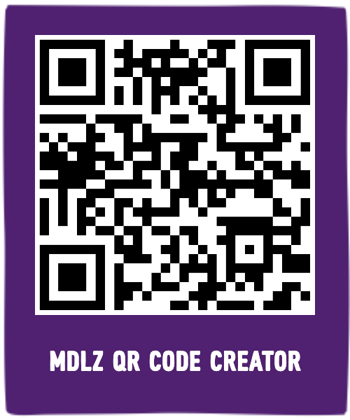

# MDLZ QR Code Formatter

Create and download a customized template for generated QR codes on your web browser. The QR code is placed within a MDLZ-shaped frame, and the MDLZ Bite Type font is used to style the caption. 

---

## Features

- 🖼 Upload any QR code
- ✍️ Add a custom caption (auto-wrapping supported!)
- 🟣 Includes purple MDLZ square frame
- 🧼 Maintains transparency in the final PNG
- 📥 Download the final image with your caption as the filename
- 🎨 Uses custom MDLZ Bite Type font

---

## How to Use

1. Visit: **[https://mjt90.github.io/QR-code-formatter/](https://mjt90.github.io/QR-code-formatter/)**  
   *(or open `index.html` locally in your browser)*

2. Upload a photo using the file input.

3. Type a caption below the image.

4. Click the **Download PNG** button to save your creation as a PNG.

---

## File Structure

├── index.html # Main web app page  
├── style.css # Styling, including font and layout  
├── script.js # Handles rendering, wrapping text, and image download  
├── fonts/  
 └── MDLZBITETYPE-REGULAR_0 3.OTF # Custom MDLZ font  
├── assets/  
 └── background.png # Transparent square frame image  
 └── mdlz_qr_code_creator.png # Example image of a download  

---

## Notes

- The canvas is transparent — when you download the PNG, it preserves transparency around the MDLZ "imperfect" square border.
- Captions are wrapped automatically to fit inside the frame and avoid overflow.
- Filenames are generated from the caption text (spaces and symbols are sanitized).
